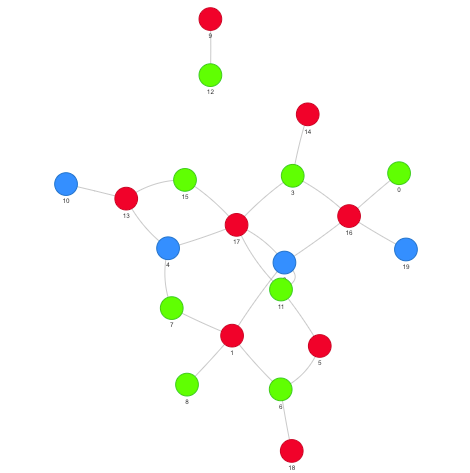

# MIPs-101-coloring
This is a very basic example of how to formulate a MIP model using Pulp python's package

## Instructions
1. After cloning this repository in your local machine, set Up the python inviroment:
```bash
$ python3 -m venv venv
$ source venv/bin/activate
$ pip install -r requirements.txt
```
2. Run the jupyter:
```bash
$ jupyter lab
```
3. Play and enjoy the **[coloring.ipynb](http://localhost:8888/lab/tree/coloring.ipynb)** notebook.